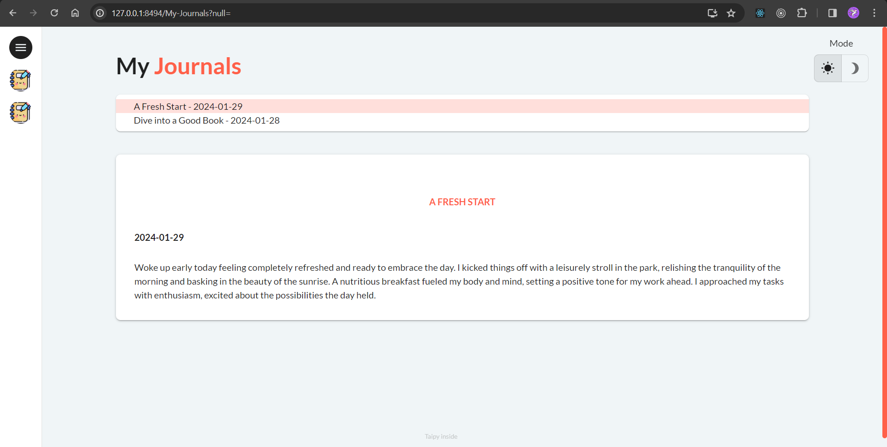
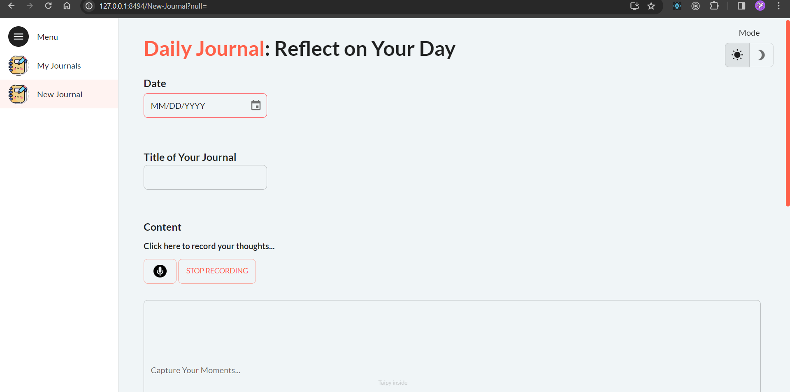

# JournalApp

JournalApp is a simple and user-friendly journaling application that allows users to capture and organize their daily moments effortlessly.

## Features

- **Voice Recording:** Record your thoughts and experiences using voice recognition technology.
- **Manual Entry:** Type and edit your journal entries manually for more control.
- **AI Summarizer:** Let the AI automatically summarize your journal entries for a quick overview.

---

